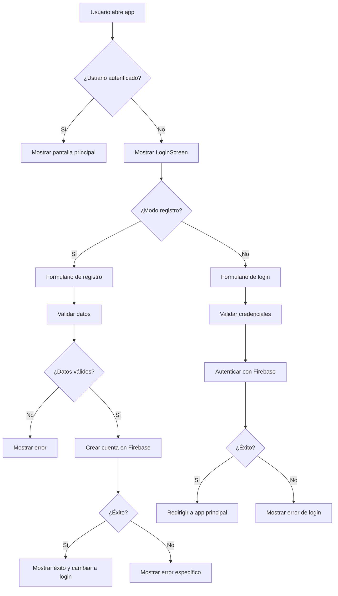

# Guía de Autenticación con Firebase

Esta guía explica cómo funciona el sistema de autenticación implementado en la aplicación.

## 🚀 Funcionalidades Implementadas

### 1. **Pantalla de Login/Registro Unificada**
- **Modo Login**: Para usuarios existentes
- **Modo Registro**: Para crear nuevas cuentas
- **Toggle dinámico**: Cambio fácil entre modos
- **Validación en tiempo real**: Verificación de email y contraseña

### 2. **Validaciones Implementadas**

#### Para Email:
- Formato válido de email (regex)
- Campo obligatorio
- Mensajes de error específicos

#### Para Contraseña:
- Mínimo 6 caracteres
- Campo obligatorio
- Confirmación de contraseña en modo registro

#### Para Registro:
- Verificación de que las contraseñas coincidan
- Validación de email único
- Manejo de errores de Firebase

### 3. **Manejo de Errores**

La aplicación maneja los siguientes errores de Firebase Auth:

| Código de Error | Mensaje en Español |
|----------------|-------------------|
| `auth/email-already-in-use` | Ya existe una cuenta con este email |
| `auth/invalid-email` | Email inválido |
| `auth/weak-password` | La contraseña es muy débil |
| `auth/user-not-found` | No existe una cuenta con este email |
| `auth/wrong-password` | Contraseña incorrecta |
| `auth/too-many-requests` | Demasiados intentos fallidos |
| `auth/network-request-failed` | Error de conexión |

## 📱 Cómo Usar la Aplicación

### Para Crear una Nueva Cuenta:

1. **Abrir la aplicación** - Verás la pantalla de "Bienvenido"
2. **Hacer clic en "Crear cuenta"** - Cambiará al modo registro
3. **Completar los campos**:
   - Email: `ejemplo@correo.com`
   - Contraseña: `mínimo 6 caracteres`
   - Confirmar contraseña: `repetir la contraseña`
4. **Hacer clic en "Crear cuenta"** - Se creará la cuenta en Firebase
5. **Mensaje de éxito** - "¡Cuenta creada exitosamente!"

### Para Iniciar Sesión:

1. **Completar los campos**:
   - Email: `tu email registrado`
   - Contraseña: `tu contraseña`
2. **Hacer clic en "Iniciar sesión"** - Se autenticará con Firebase
3. **Acceso a la aplicación** - Serás redirigido a la pantalla principal

## 🔧 Configuración Técnica

### Archivos Modificados:

1. **`screens/LoginScreen.tsx`**:
   - Interfaz unificada de login/registro
   - Validaciones de formulario
   - Manejo de estados y errores

2. **`components/Button.tsx`**:
   - Agregada propiedad `disabled`
   - Estilos para estado deshabilitado

3. **`hooks/useAuth.tsx`**:
   - Integración completa con Firebase Auth
   - Persistencia de sesión con AsyncStorage
   - Manejo de estados de autenticación

### Flujo de Autenticación:



## 🧪 Pruebas

### Datos de Prueba:

```typescript
// Usuario válido para testing
const testUser = {
  email: 'test@example.com',
  password: 'password123'
};

// Usuario nuevo para registro
const newUser = {
  email: 'nuevo@example.com',
  password: 'nuevapassword123'
};
```

### Casos de Prueba:

1. **Registro exitoso** con datos válidos
2. **Registro fallido** con email inválido
3. **Registro fallido** con contraseña débil
4. **Registro fallido** con email existente
5. **Login exitoso** con credenciales correctas
6. **Login fallido** con contraseña incorrecta
7. **Login fallido** con email inexistente

## 🔒 Seguridad

### Medidas Implementadas:

- **Validación del lado del cliente** antes de enviar a Firebase
- **Manejo seguro de errores** sin exponer información sensible
- **Persistencia segura** usando AsyncStorage
- **Validación de email** con regex
- **Contraseñas mínimas** de 6 caracteres
- **Confirmación de contraseña** en registro

### Configuración de Firebase:

- **Authentication** habilitado con Email/Password
- **Reglas de seguridad** configuradas
- **Persistencia de sesión** activada
- **Manejo de errores** personalizado

## 📋 Próximos Pasos

1. **Configurar Firebase Console**:
   - Habilitar Authentication
   - Configurar reglas de seguridad
   - Verificar configuración de proyecto

2. **Probar la funcionalidad**:
   - Crear cuenta de prueba
   - Iniciar sesión
   - Verificar persistencia

3. **Personalizar mensajes**:
   - Ajustar textos según necesidades
   - Modificar validaciones si es necesario

## 🐛 Solución de Problemas

### Error: "No se pudo crear la cuenta"
- Verificar conexión a internet
- Comprobar configuración de Firebase
- Revisar que el email no esté ya registrado

### Error: "No se pudo iniciar sesión"
- Verificar que las credenciales sean correctas
- Comprobar que la cuenta exista
- Revisar configuración de Firebase

### Error: "Email inválido"
- Verificar formato del email
- Asegurar que contenga @ y dominio válido

¡La funcionalidad de autenticación está completamente implementada y lista para usar! 🎉
